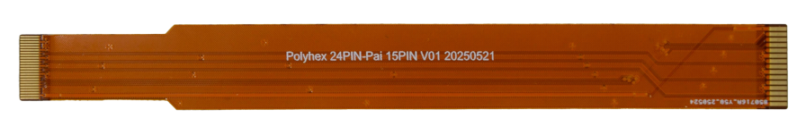
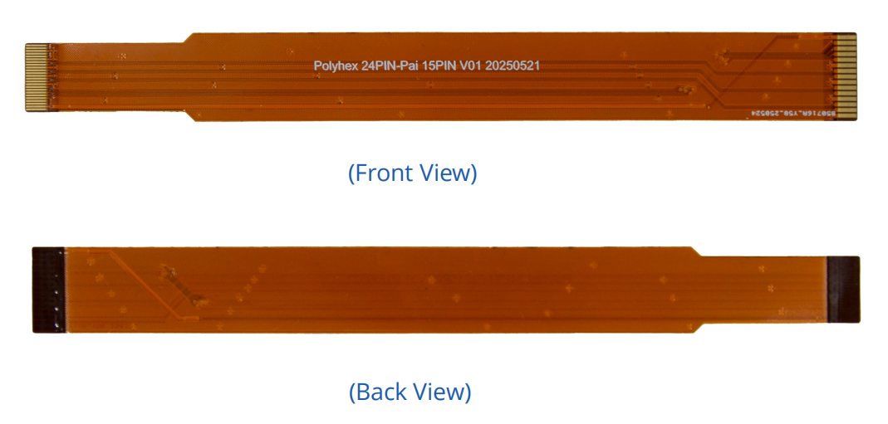

# Polyhex 24PIN-Pai 15PIN FPC
 

## Overview
Engineered for seamless connection! This FPC cable is the ideal bridge between the DEBIX 24pin/0.5mm pitch MIPI CSI connector and the standard Raspberry Pi camera port (15pin/1mm pitch FPC).

## Compatibility:
Compatible with the MIPI CSI connectors on the DEBIX Model A, DEBIX Model B, DEBIX Model C, DEBIX Infinity, and DEBIX R3576-01

## Specification
|                 |                              |
|-----------------|------------------------------|
| Pin Count & Pitch   | 24Pin (0.5mm pitch) to 15Pin (1mm pitch) |
| Insertion Thickness | 0.35-0.4mm               |
| Contact Orientation | Same side                |
| Total Length        | 15cm                     |

 

## Safety Instruction and Warnings:
- The FPC connectors and the cable ends are extremely delicate. Apply force only directly on the connector bodies, not the cable or the locking tabs. Misalignment or excessive force can bend pins, crack solder joints, or break the connector housing.
- Always completely power down the DEBIX board and disconnect any power sources before inserting or removing this FPC cable or the connected camera module.
- Avoid exposure to water, moisture, and conductive surfaces while operating.
- Store the cable flat or loosely coiled in a clean, dry, temperature-controlled environment away from direct sunlight, dust, moisture, and chemicals. Avoid placing heavy 
objects on top of it.

## Contact Us
- **Headquarters**: DEBIX Technology Inc., 8345 Gold River Ct., Las Vegas, NV 89113, USA  
- **Factory**: 5-6/F., East Zone, Shunheda A2 Building, Liqxiandong Industrial Park, XiLi, Nanshan Dist., Shenzhen, China  
- **Email**: info@debix.io  
- **Website**: [www.debix.io](https://www.debix.io)  
- **Community**: [Discord](https://discord.com/invite/adaHHaDkH2)